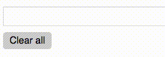

# react-tags-input [](https://travis-ci.org/jpsierens/react-tags-input) 

> A React component for inputting tags in a user friendly way



## Install
```
$ npm install --save react-tags-input
```

## Usage
```js
// import the react component
import TagsInput from 'react-tags-input';
// optionally, import the default styles.
import 'react-tags-input/build/styles.css';

class YourComponent extends Component {
  constructor(props) {
    super(props);
    this.state = {
      tags: []
    }
    this.handleTagInput = this.handleTagInput.bind(this);
    this.handleTagRemove = this.handleTagRemove.bind(this);
    this.handleTagsClear = this.handleTagsClear.bind(this);
  }
  handleTagInput(tag) {
    this.setState({ tags: [...this.state.tags, tag]});
  }
  handleTagRemove(tag) {
    this.setState({ tags: [...this.state.tags.filter(t => t !== tag)]});
  }
  handleTagsClear() {
    this.setState({ tags: []});
  }
  render() {
    return (
      <div>
        <TagsInput
	  onTagInput={this.handleTagInput}
	  onTagRemove={this.handleTagRemove}
          onClear={this.handleTagsClear} />
      </div>
    );
  }
}
```

Props:
- ```onTagInput``` [Required] (callback) for when a tag is entered
- ```onTagRemove``` [Required] (callback) for when a tag is removed
- ```onClear``` [Optional] (callback) for when all tags are cleared
- ```clearAllText``` [Optional] (string) use a different clear text than the default ("Clear all")


[Click Here](https://github.com/jpsierens/react-tags-input-example) for an example you can run and play around with.

## Made in ReasonML
This project is made in [ReasonML](https://reasonml.github.io/) and uses the [ReasonReact](https://reasonml.github.io/reason-react/) bindings to play along with React.

here's a nice book on [ReasonML](http://reasonmlhub.com/exploring-reasonml/)


## Contribute
Run this project:

```
npm install
npm start
# in another tab
npm run webpack
```

After you see the webpack compilation succeed (the `npm run webpack` step), open up the nested html files in `src/*` (**no server needed!**). Then modify whichever file in `src` and refresh the page to see the changes.

**For more elaborate ReasonReact examples**, please see https://github.com/reasonml-community/reason-react-example

## The flow
By doing ```npm start``` you are running the Reason compiler and watching for changes to Reason files (.re). When you make a change to one, it compiles it to JavaScript (.bs.js) through BuckleScript. When that happens, webpack picks up and does it's thing and throws the bundle to build/index.js. So it's a 2 step process:

BuckleScript -> Webpack -> output
